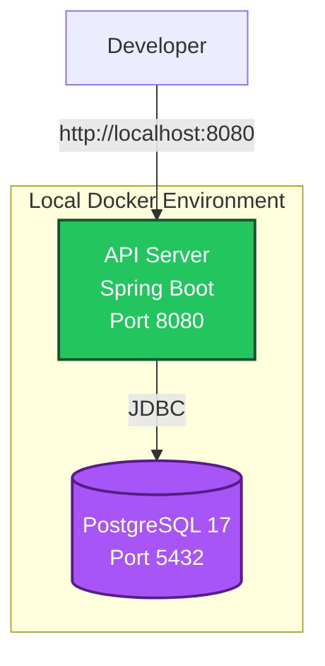
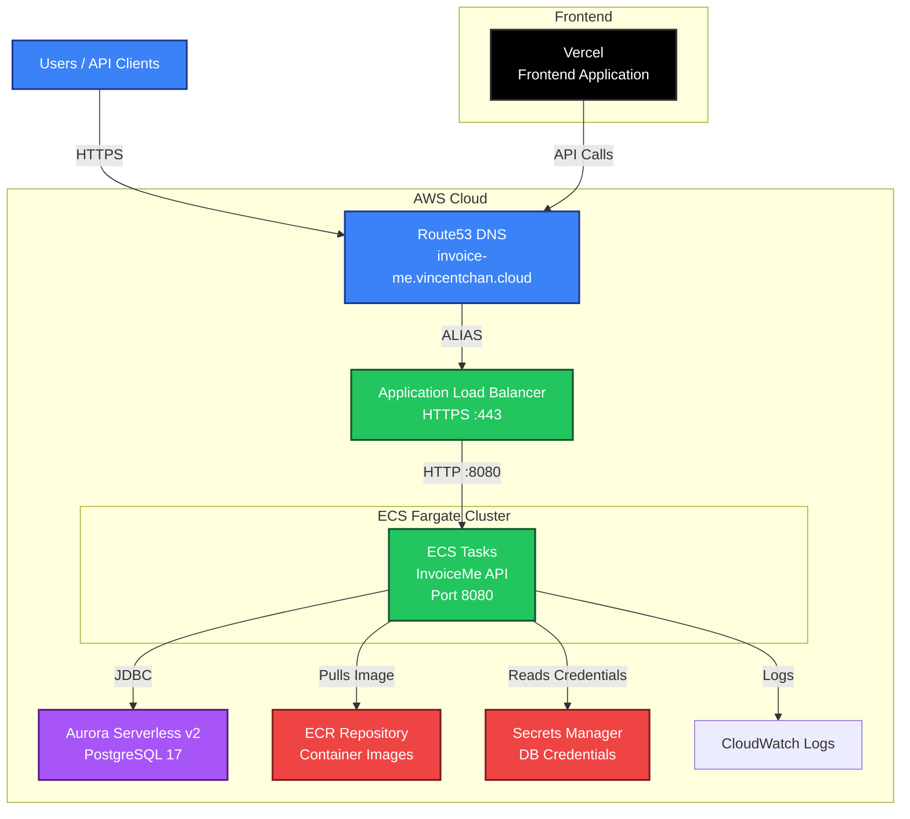

# InvoiceMe Architecture

This document describes the deployment and infrastructure architecture of the InvoiceMe system.

## Table of Contents

- [System Overview](#system-overview)
- [Deployment Architecture](#deployment-architecture)
  - [Local Development](#local-development)
  - [Production](#production)
- [Infrastructure Components](#infrastructure-components)
- [Network Architecture](#network-architecture)
- [CI/CD Pipeline](#cicd-pipeline)
- [Related Documentation](#related-documentation)

---

## System Overview

InvoiceMe is a full-stack invoicing application consisting of:

- **Backend API**: Spring Boot 3.5 REST API (Java 21)
- **Database**: PostgreSQL 17
- **Frontend**: React/TypeScript application (deployed on Vercel)

The system follows Domain-Driven Design (DDD) principles with bounded contexts for Invoice, Customer, and Payment domains.

---

## Deployment Architecture

### Local Development

Local development uses **Docker Compose** to orchestrate all backend services in a single environment.



**Components:**
- **API Server**: Spring Boot application container
  - Built from `backend/Dockerfile`
  - Exposed on `localhost:8080`
  - Connects to PostgreSQL via internal Docker network
- **PostgreSQL**: Database container
  - PostgreSQL 17 image
  - Exposed on `localhost:5432` (optional, for direct access)
  - Persistent volume for data (`pgdata`)
  - Health checks ensure API waits for DB readiness

**Configuration:**
- Services defined in `docker-compose.yml`
- Environment variables via `.env` file or compose environment
- Database schema auto-initialized via `schema.sql` on startup

**Usage:**
```bash
docker compose up --build
```

---

### Production

Production deployment uses **AWS ECS Fargate** with automated CI/CD via **GitHub Actions**.



#### Backend (API Server)

**Traffic Flow:**
1. **DNS Resolution**: `invoice-me.vincentchan.cloud` → Route53 → ALB
2. **Load Balancing**: ALB receives HTTPS traffic (port 443)
3. **SSL/TLS Termination**: ACM certificate validates domain ownership
4. **Request Routing**: ALB forwards HTTP traffic (port 8080) to ECS tasks
5. **Health Checks**: ALB monitors `/api/health` endpoint

**Components:**
- **Route53**: DNS hosting and domain resolution
  - Hosted zone: `invoice-me.vincentchan.cloud`
  - A Record (ALIAS) pointing to ALB
- **Application Load Balancer (ALB)**:
  - HTTPS listener (port 443) with ACM certificate
  - HTTP (port 80) → HTTPS redirect
  - Health checks on `/api/health`
  - Distributes traffic across ECS tasks
- **ECS Fargate**:
  - Serverless container hosting
  - Auto-scaling based on demand
  - Task configuration: 512 MB memory, 256 CPU units
  - Pulls container images from ECR
  - Logs streamed to CloudWatch

#### Database

**Aurora Serverless v2 PostgreSQL:**
- PostgreSQL 17.4 compatible
- Auto-scaling: 0.5 to 1 ACU (Aurora Capacity Units)
- High availability across multiple Availability Zones
- Encrypted at rest
- 7-day backup retention
- Accessible only from ECS tasks via security groups
- Credentials stored in AWS Secrets Manager

#### Frontend

**Vercel:**
- React/TypeScript frontend application
- Automatic deployments on push to repository
- Connects to backend API via Route53 DNS endpoint

---

## Infrastructure Components

### Security Groups

| Component | Inbound Rules | Outbound Rules |
|-----------|--------------|----------------|
| **ALB** | HTTP (80) from 0.0.0.0/0<br/>HTTPS (443) from 0.0.0.0/0 | All traffic to ECS tasks (8080) |
| **ECS Tasks** | HTTP (8080) from ALB security group | All traffic |
| **Aurora** | PostgreSQL (5432) from ECS security group | None |

### AWS Services

| Service | Purpose | Configuration |
|---------|---------|---------------|
| **ECR** | Container image registry | Repository: `vincent-chan/invoice-me` |
| **Secrets Manager** | Database credentials | Secure storage for DB username/password |
| **CloudWatch Logs** | Application logging | 7-day retention for cost optimization |
| **ACM** | SSL/TLS certificates | Domain validation via Route53 |
| **ECS** | Container orchestration | Fargate launch type, auto-scaling enabled |

### Network Configuration

- **VPC**: Uses default VPC (cost optimization - no NAT Gateway)
- **Subnets**: ECS tasks and Aurora deployed across multiple AZs
- **Internet Gateway**: Public-facing ALB for external access

---

## Network Architecture

### Request Flow (Production)

```
1. User Request
   ↓
2. DNS Query (Route53)
   ↓
3. ALB (HTTPS :443)
   ├─ SSL/TLS Termination
   ├─ Health Check Validation
   └─ Load Balancing
   ↓
4. ECS Task (HTTP :8080)
   ├─ Application Processing
   ├─ Database Query (Aurora)
   └─ Response Generation
   ↓
5. ALB → User Response
```

### Database Connection Flow

```
ECS Task
  ↓
Security Group (ECS → Aurora)
  ↓
Aurora Serverless v2
  ├─ Connection Pooling
  ├─ Query Execution
  └─ Result Return
```

---

## CI/CD Pipeline

The deployment pipeline is automated via **GitHub Actions**.

### Workflow: Build and Deploy

**Trigger:** Push to `main` branch (excluding `invoice-me-frontend/**`)

**Steps:**

1. **Checkout Repository**
   - Clones the repository code

2. **Configure AWS Credentials**
   - Uses GitHub Secrets for AWS access
   - Region: `us-east-1`

3. **Login to Amazon ECR**
   - Authenticates Docker with ECR registry

4. **Build and Push Docker Image**
   - Builds image from `./backend` context
   - Tags: `latest` and `{git-sha}`
   - Pushes to ECR repository: `vincent-chan/invoice-me`
   - Uses build cache for optimization

5. **Force ECS Service Update**
   - Triggers ECS service to pull new image
   - Waits for service to stabilize
   - Ensures zero-downtime deployment

**Configuration:**
- **ECR Repository**: `vincent-chan/invoice-me`
- **ECS Cluster**: `invoiceme-cluster`
- **ECS Service**: `invoiceme-api`
- **AWS Region**: `us-east-1`

**GitHub Secrets Required:**
- `AWS_ACCESS_KEY_ID`
- `AWS_SECRET_ACCESS_KEY`

---

## Related Documentation

- **[TECHNICAL_ARCHITECTURE.md](./TECHNICAL_ARCHITECTURE.md)**: Code architecture, DDD, CQRS, and domain design
- **[README.md](./README.md)**: Project overview, setup instructions, and API documentation
- **[infra/cdk/README.md](./infra/cdk/README.md)**: CDK infrastructure deployment guide

---

## Cost Optimization

- **Default VPC**: Eliminates NAT Gateway costs (~$64/month savings)
- **Aurora Serverless v2**: Auto-scales down when idle
- **Fargate**: Pay only for running tasks
- **CloudWatch Logs**: 7-day retention for cost savings

## High Availability

- **Aurora Serverless v2**: Automatically distributes across multiple Availability Zones
- **ECS Fargate**: Tasks can be distributed across AZs
- **ALB**: Provides automatic failover and health checks
- **Multi-AZ Deployment**: Ensures resilience against single-AZ failures

