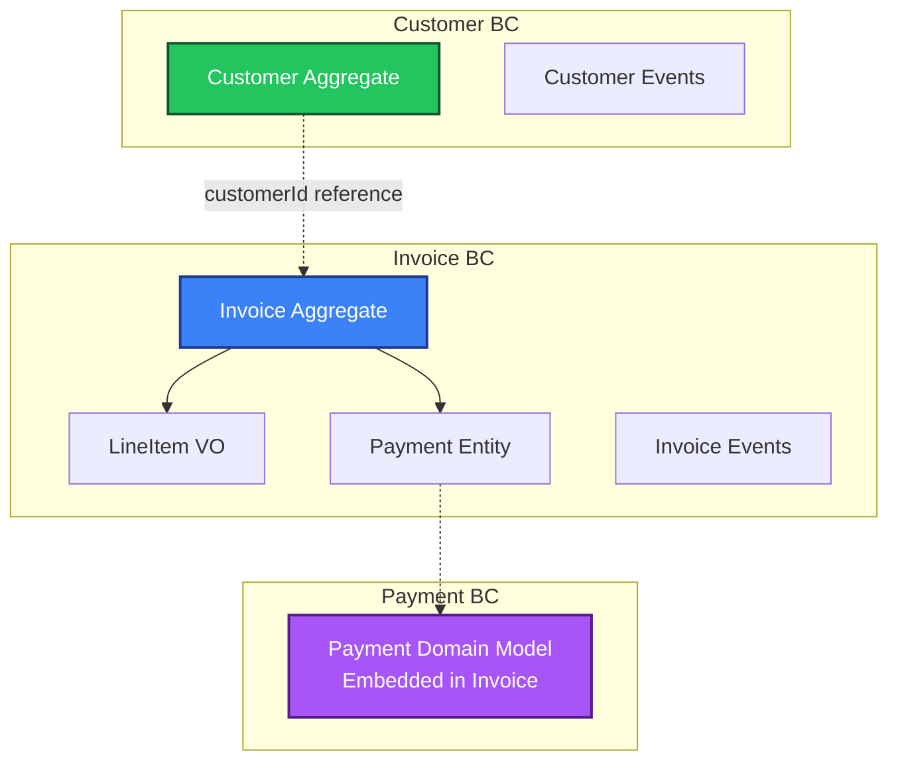
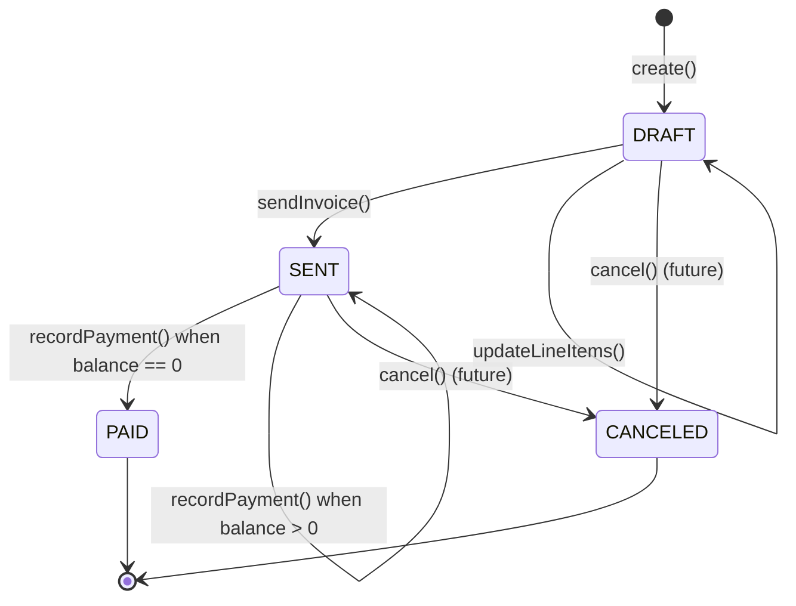
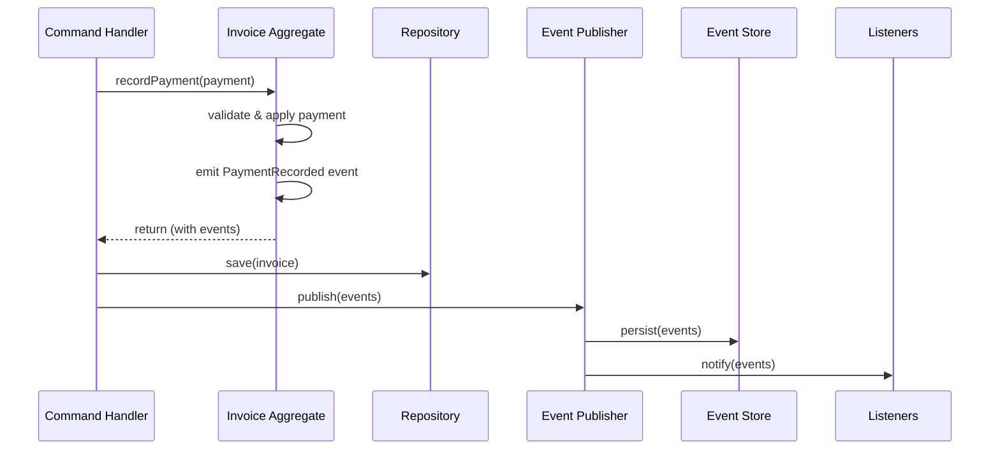

# Domain-Driven Design (DDD) Documentation

This document describes the Domain-Driven Design implementation in InvoiceMe, including bounded contexts, aggregates, value objects, domain events, and strategic design decisions.

## Table of Contents

- [Overview](#overview)
- [Strategic Design](#strategic-design)
  - [Bounded Contexts](#bounded-contexts)
  - [Subdomains](#subdomains)
  - [Context Mapping](#context-mapping)
- [Tactical Design](#tactical-design)
  - [Aggregates](#aggregates)
  - [Value Objects](#value-objects)
  - [Domain Events](#domain-events)
  - [Repositories](#repositories)
- [Domain Model Details](#domain-model-details)
  - [Customer Bounded Context](#customer-bounded-context)
  - [Invoice Bounded Context](#invoice-bounded-context)
  - [Payment Bounded Context](#payment-bounded-context)
- [Design Patterns](#design-patterns)
- [Design Decisions](#design-decisions)
- [Future Evolution](#future-evolution)

---

## Overview

InvoiceMe applies **Domain-Driven Design (DDD)** to model the invoicing domain with clear boundaries, rich domain models, and explicit business rules. The system is organized into **bounded contexts** that encapsulate distinct business capabilities.

### Core DDD Principles Applied

1. **Ubiquitous Language**: Domain terms (Invoice, Customer, Payment, LineItem) are used consistently across code, documentation, and conversations
2. **Rich Domain Models**: Business logic lives in domain entities, not in services or controllers
3. **Aggregate Boundaries**: Clear consistency boundaries enforced by aggregate roots
4. **Domain Events**: State changes are communicated through immutable domain events
5. **Layered Architecture**: Clear separation between domain, application, infrastructure, and presentation layers

---

## Strategic Design

### Bounded Contexts

InvoiceMe defines three bounded contexts, each representing a distinct area of business capability:



#### 1. Customer Bounded Context

**Purpose**: Manages customer information and contact details.

**Key Concepts**:
- Customer aggregate root
- Contact information (email, address, phone)
- Payment terms preferences

**Responsibilities**:
- Customer lifecycle management (create, update, delete)
- Contact information validation
- Payment terms configuration

#### 2. Invoice Bounded Context (Core Domain)

**Purpose**: Manages the invoice lifecycle from creation to payment.

**Key Concepts**:
- Invoice aggregate root
- Line items (value objects)
- Invoice status lifecycle
- Payment recording

**Responsibilities**:
- Invoice creation and editing
- Status transitions (DRAFT → SENT → PAID)
- Payment recording and balance calculation
- Business rule enforcement

#### 3. Payment Bounded Context

**Purpose**: Represents payment transactions (currently embedded in Invoice).

**Key Concepts**:
- Payment entity (owned by Invoice)
- Payment methods
- Payment recording

**Responsibilities**:
- Payment transaction representation
- Payment method tracking
- Payment reference management

**Note**: In the MVP, Payment is embedded within the Invoice aggregate for transactional simplicity. This may evolve into a separate aggregate in the future.

### Subdomains

| Subdomain | Type | Description |
|-----------|------|-------------|
| **Invoice** | Core Domain | The primary business capability - invoicing and payment tracking |
| **Customer** | Supporting Domain | Essential but not differentiating - customer management |
| **Payment** | Supporting Domain | Essential but not differentiating - payment processing |

### Context Mapping

**Current State (MVP)**:
- **Shared Kernel**: Common value objects (`Money`, `Email`, `Address`) and domain event infrastructure
- **Customer → Invoice**: Reference by ID only (no direct coupling)
- **Payment → Invoice**: Embedded entity (same transaction boundary)

**Future Evolution**:
- **Customer ↔ Invoice**: May use domain events for eventual consistency
- **Payment → Invoice**: May become separate aggregate with event-driven consistency

---

## Tactical Design

### Aggregates

Aggregates are consistency boundaries that ensure business invariants are maintained.

#### Aggregate Design Principles

1. **One Aggregate Root per Aggregate**: Only the root can be loaded from the repository
2. **Invariant Enforcement**: All business rules are enforced within aggregate boundaries
3. **Event Sourcing**: State changes emit domain events
4. **Optimistic Locking**: Version field prevents concurrent modification conflicts

#### Aggregate: Customer

**Root**: `Customer`

**Owns**: None (simple aggregate)

**References**: None

**Invariants**:
- Email must be valid (enforced by `Email` value object)
- Name cannot be null or empty
- Address must be provided

**Business Rules**:
- Customer can be updated at any time
- Deletion emits `CustomerDeleted` event (soft delete pattern possible)

**Events Emitted**:
- `CustomerCreated`
- `CustomerUpdated`
- `CustomerDeleted`

#### Aggregate: Invoice

**Root**: `Invoice`

**Owns**:
- `LineItem` (value objects)
- `Payment` (entities)

**References**: `CustomerId` (reference to Customer aggregate)

**Invariants**:
- Only editable while status == `DRAFT`
- `sum(payments.amount) ≤ total`
- When balance == 0 → status = `PAID`
- Must have at least one line item

**Business Rules**:
- Status transitions: `DRAFT` → `SENT` → `PAID` (or `CANCELED`)
- Payments cannot exceed outstanding balance
- Line items can only be modified in `DRAFT` status
- Total = subtotal + tax (tax calculated from subtotal × tax rate)

**Events Emitted**:
- `InvoiceCreated`
- `InvoiceUpdated`
- `InvoiceSent`
- `PaymentRecorded`
- `InvoicePaid`

**Lifecycle**:



### Value Objects

Value objects are immutable objects defined by their attributes, not identity. They encapsulate domain concepts and enforce validation.

#### Shared Value Objects

| Value Object | Purpose | Validation |
|--------------|---------|------------|
| `Money` | Encapsulates amount and currency | Amount ≥ 0, valid currency code |
| `Email` | Email address | Valid email format |
| `Address` | Physical address | Street, city, postal code, country |

#### Invoice Value Objects

| Value Object | Purpose | Validation |
|--------------|---------|------------|
| `InvoiceNumber` | Unique invoice identifier | Format: `INV-YYYY-####` |
| `InvoiceStatus` | Invoice lifecycle state | Enum: `DRAFT`, `SENT`, `PAID`, `CANCELED` |
| `LineItem` | Invoice line item | Description, quantity > 0, unit price ≥ 0 |

#### Customer Value Objects

| Value Object | Purpose | Validation |
|--------------|---------|------------|
| `PaymentTerms` | Default payment terms | Enum: `NET_15`, `NET_30`, `NET_45`, `DUE_ON_RECEIPT` |

**Value Object Characteristics**:
- **Immutability**: Once created, cannot be modified
- **Equality by Value**: Two value objects with same attributes are equal
- **Self-Validation**: Constructor enforces invariants
- **No Identity**: No unique ID field

### Domain Events

Domain events represent something that happened in the past. They are immutable and carry just enough information for event handlers to react.

#### Event Structure

All domain events implement the `DomainEvent` interface:

```java
public interface DomainEvent {
    Instant occurredAt();
}
```

#### Event Catalog

| Event | Aggregate | Triggered By | Payload |
|-------|-----------|--------------|---------|
| `CustomerCreated` | Customer | `Customer.create()` | `id`, `name`, `email`, `occurredAt` |
| `CustomerUpdated` | Customer | `updateName()`, `updateContactInfo()`, `setDefaultPaymentTerms()` | `id`, `occurredAt` |
| `CustomerDeleted` | Customer | `delete()` | `id`, `occurredAt` |
| `InvoiceCreated` | Invoice | `Invoice.create()` | `id`, `customerId`, `invoiceNumber`, `occurredAt` |
| `InvoiceUpdated` | Invoice | `updateLineItems()`, `updateDueDate()`, etc. | `id`, `occurredAt` |
| `InvoiceSent` | Invoice | `sendInvoice()` | `id`, `customerId`, `invoiceNumber`, `occurredAt` |
| `PaymentRecorded` | Invoice | `recordPayment()` | `id`, `paymentId`, `amount`, `method`, `occurredAt` |
| `InvoicePaid` | Invoice | `recordPayment()` (when balance == 0) | `id`, `customerId`, `invoiceNumber`, `occurredAt` |

#### Event Flow



**Event Publishing Pattern**:
1. Aggregate raises events internally (stored in `domainEvents` list)
2. Command handler saves aggregate to repository
3. Command handler calls `pullDomainEvents()` to get events
4. Application layer publishes events via `DomainEventPublisher`
5. Infrastructure layer persists events and notifies listeners

### Repositories

Repositories provide an abstraction over persistence, allowing the domain to remain independent of infrastructure concerns.

#### Repository Pattern

**Domain Interface** (in domain layer):
```java
public interface InvoiceRepository {
    void save(Invoice invoice);
    Optional<Invoice> findById(UUID id);
    List<Invoice> findAll();
}
```

**Infrastructure Implementation** (in infrastructure layer):
- `InvoiceRepositoryAdapter` implements domain interface
- Uses JPA entities and Spring Data JPA repositories
- Maps between domain objects and persistence entities

**Key Principles**:
- Repository interface defined in domain layer
- Implementation in infrastructure layer
- Only aggregate roots are loaded via repositories
- Child entities loaded as part of aggregate

---

## Domain Model Details

### Customer Bounded Context

#### Aggregate: Customer

**Class**: `com.invoiceme.customer.domain.Customer`

**Attributes**:
- `id: UUID` (immutable)
- `name: String`
- `email: Email` (value object)
- `address: Address` (value object)
- `phone: String` (optional)
- `defaultPaymentTerms: PaymentTerms` (value object)

**Factory Methods**:
- `create()`: Creates new customer, emits `CustomerCreated`
- `reconstruct()`: Reconstructs from persistence (no events)

**Business Methods**:
- `updateName(String name)`: Updates customer name
- `updateContactInfo(Address, Email, String phone)`: Updates contact information
- `setDefaultPaymentTerms(PaymentTerms)`: Updates payment terms
- `delete()`: Marks customer as deleted, emits `CustomerDeleted`

**Invariants**:
- Name cannot be null or empty
- Email must be valid (enforced by `Email` value object)
- Address must be provided
- Payment terms must be provided

### Invoice Bounded Context

#### Aggregate: Invoice

**Class**: `com.invoiceme.invoice.domain.Invoice`

**Attributes**:
- `id: UUID` (immutable)
- `customerId: UUID` (reference to Customer)
- `invoiceNumber: InvoiceNumber` (value object, immutable)
- `issueDate: LocalDate` (immutable)
- `dueDate: LocalDate`
- `status: InvoiceStatus` (value object)
- `lineItems: List<LineItem>` (value objects)
- `payments: List<Payment>` (entities)
- `notes: String` (optional)
- `taxRate: BigDecimal`

**Factory Methods**:
- `create()`: Creates new invoice in `DRAFT` status, emits `InvoiceCreated`
- `reconstruct()`: Reconstructs from persistence (no events)

**Business Methods**:
- `addLineItem(LineItem)`: Adds line item (only in `DRAFT`)
- `updateLineItems(List<LineItem>)`: Replaces all line items (only in `DRAFT`)
- `updateDueDate(LocalDate)`: Updates due date (only in `DRAFT`)
- `updateTaxRate(BigDecimal)`: Updates tax rate (only in `DRAFT`)
- `updateNotes(String)`: Updates notes (only in `DRAFT`)
- `sendInvoice()`: Transitions to `SENT` status, emits `InvoiceSent`
- `recordPayment(Payment)`: Records payment, emits `PaymentRecorded` (and `InvoicePaid` if balance == 0)

**Calculation Methods**:
- `calculateSubtotal()`: Sum of all line item subtotals
- `calculateTax()`: Subtotal × tax rate
- `calculateTotal()`: Subtotal + tax
- `calculateBalance()`: Total - sum of payments

**Invariants**:
- Must have at least one line item
- Only editable in `DRAFT` status
- Payment amount cannot exceed outstanding balance
- When balance == 0, status must be `PAID`
- Tax rate must be ≥ 0

#### Value Object: LineItem

**Class**: `com.invoiceme.invoice.domain.LineItem`

**Attributes**:
- `description: String`
- `quantity: BigDecimal`
- `unitPrice: Money` (value object)
- `subtotal: Money` (calculated: quantity × unitPrice)

**Characteristics**:
- Immutable
- Equality by value
- Subtotal calculated in constructor

### Payment Bounded Context

#### Entity: Payment

**Class**: `com.invoiceme.payment.domain.Payment`

**Attributes**:
- `id: UUID`
- `invoiceId: UUID` (reference to Invoice aggregate)
- `amount: Money` (value object)
- `paymentDate: LocalDate`
- `method: PaymentMethod` (enum)
- `reference: String` (optional, e.g., transaction ID)

**Note**: Currently embedded within Invoice aggregate. Owned by Invoice, not a separate aggregate root.

**Payment Methods**:
- `CASH`
- `BANK_TRANSFER`
- `CREDIT_CARD`
- `CHECK`
- `OTHER`

---

## Design Patterns

### Aggregate Pattern

**Implementation**:
- Aggregate root encapsulates child entities and value objects
- Only aggregate root accessible from outside
- Consistency boundary enforced by aggregate root

**Example**: `Invoice` aggregate owns `LineItem` (VO) and `Payment` (entity)

### Repository Pattern

**Implementation**:
- Domain interface in domain layer
- Infrastructure implementation in infrastructure layer
- Abstraction over persistence mechanism

### Domain Events Pattern

**Implementation**:
- Events raised by aggregates during state changes
- Events collected via `pullDomainEvents()`
- Published by application layer after persistence
- Stored in `domain_events` table for audit trail

### Factory Pattern

**Implementation**:
- `create()` static methods for aggregate creation
- `reconstruct()` static methods for loading from persistence
- Enforces invariants at creation time

### Value Object Pattern

**Implementation**:
- Immutable classes
- Validation in constructor
- Equality by value (not identity)
- No setters, only factory methods if needed

---

## Design Decisions

### 1. Payment Embedded in Invoice

**Decision**: Payment is an entity owned by Invoice aggregate, not a separate aggregate.

**Rationale**:
- Ensures transactional consistency (payment and invoice update atomically)
- Simpler MVP implementation
- Payment amount validation requires invoice balance calculation

**Trade-offs**:
- Limits flexibility for cross-invoice payments
- Future: May need to extract Payment as separate aggregate

### 2. LineItem as Value Object

**Decision**: LineItem is a value object, not an entity.

**Rationale**:
- Line items have no identity outside invoice context
- Immutability prevents accidental modification
- Equality by value simplifies comparisons

**Trade-offs**:
- Cannot track individual line item changes over time
- Future: May need to become entity for partial fulfillment

### 3. In-Memory Event Publishing

**Decision**: Domain events published synchronously in-memory, stored in database.

**Rationale**:
- Simpler MVP implementation
- Provides audit trail via `domain_events` table
- Sufficient for current needs

**Trade-offs**:
- No async cross-service propagation
- Future: May need Kafka/SNS for distributed systems

### 4. Customer Reference by ID

**Decision**: Invoice holds `customerId` (UUID), not Customer entity.

**Rationale**:
- Maintains aggregate boundaries
- Prevents coupling between bounded contexts
- Customer can be deleted without affecting invoice history

**Trade-offs**:
- Requires separate query to load customer details
- Future: May use domain events for eventual consistency

### 5. Derived State at Query Time

**Decision**: Balance and overdue status calculated at query time, not stored.

**Rationale**:
- Ensures correctness (no denormalization drift)
- Single source of truth (line items and payments)
- Simpler domain model

**Trade-offs**:
- Slightly more expensive queries
- Future: May add read model projections for performance

### 6. Optimistic Locking

**Decision**: Use `version` field for optimistic concurrency control.

**Rationale**:
- Prevents lost updates in concurrent scenarios
- Standard JPA pattern
- Better performance than pessimistic locking

**Trade-offs**:
- Requires retry logic on version conflicts
- Application must handle `OptimisticLockException`

---

## Future Evolution

### Payment as Separate Aggregate

**When**: Multi-invoice payments, Stripe integration, async webhooks

**How**:
- Extract Payment to own aggregate root
- Use domain events for consistency (`PaymentRecorded` → `InvoicePaid`)
- Payment aggregate validates against invoice balance via event handler

**Impact**:
- More complex consistency model (eventual consistency)
- Enables cross-invoice payment scenarios

### LineItem as Entity

**When**: Partial fulfillment, line-item-level payments

**How**:
- Add identity to LineItem
- Track fulfillment status per line item
- Enable partial payments against specific line items

**Impact**:
- More complex Invoice aggregate
- Additional invariants (e.g., line item cannot be paid more than subtotal)

### Business/Tenant Aggregate

**When**: Multi-tenant support needed

**How**:
- Add Business aggregate root
- Link Customers and Invoices to Business
- Separate bounded context for tenant management

**Impact**:
- Tenant isolation at aggregate level
- Additional security and data segregation requirements

### Event Sourcing

**When**: Full audit trail, time travel, complex event replay needs

**How**:
- Store events as source of truth
- Reconstruct aggregates from event stream
- Maintain snapshots for performance

**Impact**:
- More complex persistence model
- Enables powerful querying and analytics

### CQRS with Read Models

**When**: Complex queries, reporting, analytics

**How**:
- Maintain denormalized read models
- Update via domain event handlers
- Separate read/write databases

**Impact**:
- Better query performance
- More complex consistency model
- Additional infrastructure

---

## Related Documentation

- **[TECHNICAL_ARCHITECTURE.md](./TECHNICAL_ARCHITECTURE.md)**: Technical implementation details, CQRS, VSA
- **[ARCHITECTURE.md](./ARCHITECTURE.md)**: Deployment and infrastructure architecture
- **[README.md](./README.md)**: Project overview and setup instructions

---

## Summary

InvoiceMe applies DDD principles to create a well-structured domain model with:

- **3 Bounded Contexts**: Customer, Invoice, Payment
- **2 Aggregate Roots**: Customer, Invoice
- **Rich Value Objects**: Money, Email, Address, LineItem, InvoiceNumber, etc.
- **Domain Events**: 8 event types tracking all state changes
- **Clear Boundaries**: Aggregate boundaries enforce consistency
- **Business Logic in Domain**: All invariants and rules in domain layer

The architecture balances **simplicity for MVP** with **extensibility for future growth**, following DDD best practices while remaining pragmatic.

