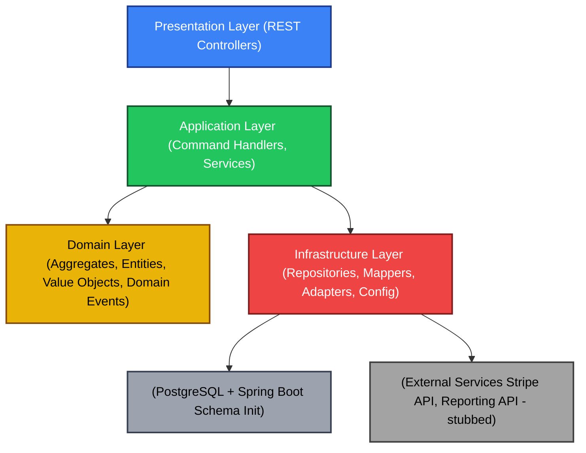
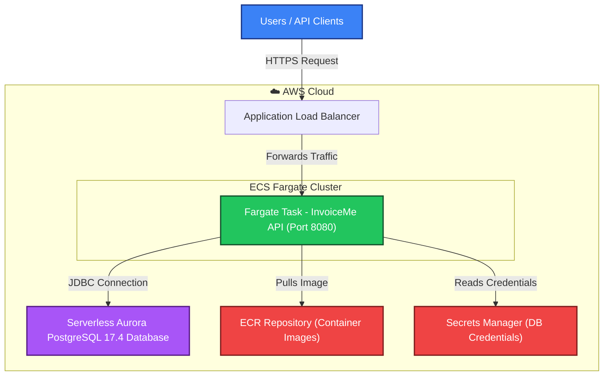

# InvoiceMe API

A **modular invoicing ERP backend**, built with **Spring Boot 3.5**, **PostgreSQL**, and **Docker**, designed around **Domain-Driven Design (DDD)** and **clean architecture**.
The project focuses on containerization, database schema management, and test-driven design — with a complete Invoice and Customer implementation, and payment tracking capabilities.

---

## Test Coverage Summary (JaCoCo)

Current test report summary:
Generated: Nov 08, 2025

* Total tests: 167/167 passing (100% success rate, 5.9s execution time)
* Invoice domain tests: 10/10 passing
* Invoice repository tests: 4/4 passing
* Invoice command handler tests: 20/20 passing
* Invoice API integration tests: 20/20 passing
* Customer domain tests: 15/15 passing
* Customer command handler tests: 4/4 passing
* Customer API tests: 3/3 passing
* Payment domain tests: 10/10 passing
* Shared infrastructure tests: 81/81 passing

**Generated by running:** `./backend/generate-test-report.sh`

---

JaCoCo report generated from integration and domain test suite:

| Metric | Covered | Total | Coverage |
|--------|----------|--------|-----------|
| Instructions | 4,437 | 5,719 | **77%** |
| Branches | 162 | 318 | **50%** |
| Lines | 1,073 | 1,317 | **81%** |
| Methods | 331 | 398 | **83%** |
| Classes | 79 | 85 | **92%** |

**Report location:**  
`backend/build/reports/jacoco/test/html/index.html`

---

## 🧠 Overview

InvoiceMe is a backend service for managing invoices within a lightweight ERP environment.
It provides fully functional **Invoice** and **Customer** bounded contexts with payment tracking capabilities.

### Core Features

* **Invoice Management** — Full lifecycle (`DRAFT → SENT → PAID → CANCELED`)
* **Customer Management** — CRUD operations with contact info and payment terms
* **Payment Tracking** — Record payments against invoices with balance calculations
* **Query Endpoints** — List invoices, overdue invoices, and customer outstanding balances
* **REST API** — Full CRUD with validation and standardized error responses
* **Testcontainers** — Comprehensive integration tests with real PostgreSQL
* **DDD Architecture** — Modular package structure with domain events
* **OpenAPI Documentation** — Auto-generated Swagger UI and OpenAPI 3.0 spec
* **Event Persistence** — Domain events stored for debugging and audit
* **AWS Ready** — ECS Fargate + Aurora Serverless deployment configuration

### Future Enhancements

* **Reporting** — Revenue summaries, KPIs, analytics
* **Payment Integration** — Stripe/PayPal integration via anti-corruption layer
* **Recurring Invoices** — Automated billing cycles
* **Multi-currency** — Enhanced currency support

---

## 🧩 Architecture

InvoiceMe follows a **Domain-Driven Design (DDD)** + **Hexagonal (Ports & Adapters)** architecture.



Each bounded context (e.g., `invoice`, `customer`, `reporting`) is isolated within its own package and database schema.
Integration between contexts will later occur through **ACLs (Anti-Corruption Layers)** or **domain events**, ensuring semantic isolation.

---

## ⚙️ Tech Stack

* **Language:** Java 21
* **Framework:** Spring Boot 3.5
* **Build Tool:** Gradle (Kotlin DSL)
* **Database:** PostgreSQL 17
* **Schema Management:** Spring Boot SQL initialization (`schema.sql`)
* **Tests:** JUnit 5 + Testcontainers
* **Containerization:** Docker & Docker Compose
* **Docs:** OpenAPI 3.0 / Swagger UI (springdoc-openapi)
* **Deployment:** AWS ECS Fargate + Aurora Serverless v2 (CDK)

---

## 💻 Local Development

### Prerequisites

* Docker & Docker Compose
* (Optional) Java 21 for manual builds

### Run with Docker Compose

```bash
docker compose up --build
```

This:

* Starts PostgreSQL 17 on port `5432`
* Builds and runs the API container on port `8080`
* Waits until Postgres is healthy before launching
* Automatically initializes database schema on startup

**Health check:**

```bash
curl http://localhost:8080/api/health
```

Expected:

```json
{"status":"ok"}
```

**Development Mode with Seed Data:**

To start with demo data pre-loaded:

```bash
SPRING_PROFILES_ACTIVE=dev docker compose up --build
```

This will automatically seed 3 demo customers and 3 invoices (1 overdue) if the database is empty.

### Local Gradle Build (no Docker)

```bash
cd backend
./gradlew clean test bootJar
```

---

## 🔌 API Endpoints

All endpoints require BasicAuth authentication (default: `admin:admin`). Credentials can be configured via environment variables `SPRING_SECURITY_USER_NAME` and `SPRING_SECURITY_USER_PASSWORD`.

### Health Check

```bash
curl http://localhost:8080/api/health
```

### Customer Endpoints

#### Create Customer

```bash
curl -u admin:admin -X POST http://localhost:8080/api/customers \
  -H "Content-Type: application/json" \
  -d '{
    "name": "Acme Corporation",
    "email": "billing@acme.com",
    "phone": "555-0100",
    "address": {
      "street": "123 Business Ave",
      "city": "New York",
      "postalCode": "10001",
      "country": "US"
    },
    "paymentTerms": "NET_30"
  }'
```

#### List Customers

```bash
curl -u admin:admin http://localhost:8080/api/customers
```

#### Get Customer by ID

```bash
curl -u admin:admin http://localhost:8080/api/customers/{id}
```

#### Update Customer

```bash
curl -u admin:admin -X PUT http://localhost:8080/api/customers/{id} \
  -H "Content-Type: application/json" \
  -d '{"name": "Updated Name", ...}'
```

#### Delete Customer

```bash
curl -u admin:admin -X DELETE http://localhost:8080/api/customers/{id}
```

### Invoice Endpoints

#### Create Invoice

```bash
curl -u admin:admin -X POST http://localhost:8080/api/invoices \
  -H "Content-Type: application/json" \
  -d '{
    "customerId": "uuid-here",
    "lineItems": [
      {
        "description": "Web Development",
        "quantity": 40,
        "unitPriceAmount": 150.00,
        "unitPriceCurrency": "USD"
      }
    ],
    "issueDate": "2025-01-01",
    "dueDate": "2025-01-31",
    "taxRate": 0.10,
    "notes": "Q1 project"
  }'
```

#### List All Invoices

```bash
curl -u admin:admin http://localhost:8080/api/invoices
```

#### Get Invoice by ID

```bash
curl -u admin:admin http://localhost:8080/api/invoices/{id}
```

#### Update Invoice (Draft only)

```bash
curl -u admin:admin -X PUT http://localhost:8080/api/invoices/{id} \
  -H "Content-Type: application/json" \
  -d '{"lineItems": [...], "dueDate": "2025-02-15"}'
```

#### Send Invoice

```bash
curl -u admin:admin -X POST http://localhost:8080/api/invoices/{id}/send
```

#### Record Payment

```bash
curl -u admin:admin -X POST http://localhost:8080/api/invoices/{id}/payments \
  -H "Content-Type: application/json" \
  -d '{
    "amount": 250.00,
    "paymentDate": "2025-01-15",
    "method": "BANK_TRANSFER",
    "reference": "TXN001"
  }'
```

### Query Endpoints

#### List Overdue Invoices

```bash
curl -u admin:admin http://localhost:8080/api/invoices/overdue
```

#### List Customers with Outstanding Balances

```bash
curl -u admin:admin http://localhost:8080/api/customers/outstanding
```

---

## 🧪 Testing

```bash
cd backend
./gradlew test
```

Tests include:

* Domain invariants (business rules)
* Repository and persistence integration
* Command handler logic
* REST API validation (MockMvc)
* Future: Performance & security benchmarks

---

## 🗂 Project Structure

```
backend/
├── src/
│   ├── main/
│   │   ├── java/com/invoiceme/
│   │   │   ├── invoice/              # Invoice bounded context
│   │   │   ├── customer/             # Customer bounded context
│   │   │   ├── payment/              # Payment bounded context
│   │   │   ├── shared/               # Common utilities & base types
│   │   └── resources/
│   │       ├── application.yml
│   │       ├── application-prod.yml
│   │       ├── application-dev.yml   # Dev profile with seed data
│   │       └── schema.sql            # Database schema (Spring Boot init)
│   └── test/
│       └── java/com/invoiceme/
└── Dockerfile
```

---

## 🛢 Database Configuration

| Environment    | Host       | Port   | DB          | User        | Password    |
| -------------- | ---------- | ------ | ----------- | ----------- | ----------- |
| Local (Docker) | `postgres` | `5432` | `invoiceme` | `invoiceme` | `invoiceme` |

**JDBC URL:**
`jdbc:postgresql://postgres:5432/invoiceme`

**Schema Management:**
Spring Boot automatically initializes the database schema on startup using `schema.sql`. The schema includes:
- `customers` table
- `invoices`, `line_items`, and `payments` tables
- `domain_events` table (for event persistence)
- All indexes and foreign key constraints

---

## 📘 API Documentation

**Swagger UI:** [http://localhost:8080/swagger-ui.html](http://localhost:8080/swagger-ui.html)
**OpenAPI Spec:** [http://localhost:8080/v3/api-docs](http://localhost:8080/v3/api-docs)

The OpenAPI specification is automatically generated from the codebase and exported to `backend/openapi.json` for version control.

**Authentication:**
- Swagger UI and OpenAPI endpoints are **public** (no authentication required)
- All `/api/**` endpoints require **BasicAuth** (default: `admin:admin`)
- Credentials can be configured via environment variables:
  - `SPRING_SECURITY_USER_NAME` (default: `admin`)
  - `SPRING_SECURITY_USER_PASSWORD` (default: `admin`)

---

## ☁️ AWS Architecture

The InvoiceMe API is designed for deployment on AWS using a serverless, auto-scaling architecture.

### Architecture Overview



### Architecture Components

#### 1. **Route53 DNS**
- **Purpose**: Domain name resolution and TLS enablement
- **Configuration**:
  - Hosted Zone: `invoice-me.vincentchan.cloud` (not managed by CDK)
  - A Record (ALIAS): Points to Application Load Balancer
  - Works with ACM certificate to enable HTTPS/TLS
- **Note**: Route53 hosted zone must be created separately before deployment

#### 2. **Application Load Balancer (ALB)**
- **Purpose**: Public-facing HTTPS endpoint
- **Features**:
  - HTTP (port 80) → HTTPS (port 443) redirect
  - SSL/TLS termination with ACM certificate
  - Health checks on `/api/health`
  - Distributes traffic across ECS tasks
  - Receives traffic via Route53 ALIAS record

#### 3. **ECS Fargate**
- **Purpose**: Serverless container hosting
- **Configuration**:
  - Auto-scaling based on demand
  - 512 MB memory, 256 CPU units per task
  - Pulls container images from ECR
  - Logs streamed to CloudWatch

#### 4. **Aurora Serverless v2 PostgreSQL**
- **Purpose**: Managed, auto-scaling database
- **Features**:
  - PostgreSQL 17.4 compatible
  - Auto-scales from 0.5 to 1 ACU (Aurora Capacity Units)
  - High availability across multiple AZs
  - Encrypted at rest
  - 7-day backup retention

#### 5. **Security Groups**
- **ALB Security Group**: Accepts HTTP/HTTPS from internet (0.0.0.0/0)
- **ECS Security Group**: Accepts traffic from ALB only (port 8080)
- **RDS Security Group**: Accepts PostgreSQL from ECS only (port 5432)

#### 6. **AWS Services**
- **ECR**: Container image registry
- **Secrets Manager**: Stores database credentials securely
- **CloudWatch Logs**: Centralized application logging

### Network Flow

1. **DNS Resolution**: Users → Route53 (DNS query) → A Record (ALIAS) → ALB
2. **Inbound Traffic**: Users → ALB (HTTPS :443) → ECS Tasks (HTTP :8080)
3. **TLS/SSL**: ACM Certificate validates domain ownership via Route53
4. **Database Access**: ECS Tasks → Aurora (PostgreSQL :5432)
5. **Image Pulls**: ECS Tasks → ECR (via public IPs)
6. **Logging**: ECS Tasks → CloudWatch Logs
7. **Credentials**: ECS Tasks → Secrets Manager

### TLS/HTTPS Setup

TLS/HTTPS is enabled through the combination of:
1. **Route53 Hosted Zone**: `invoice-me.vincentchan.cloud` (created separately, not in CDK)
2. **A Record (ALIAS)**: Points to the Application Load Balancer
3. **ACM Certificate**: Validates domain ownership via Route53 DNS validation
4. **ALB HTTPS Listener**: Terminates SSL/TLS and forwards to ECS tasks

**Note**: The Route53 hosted zone must be created and configured before deploying the CDK stack. The A Record ALIAS should point to the ALB DNS name after deployment.

### Cost Optimization

- **Default VPC**: Eliminates NAT Gateway costs (~$64/month savings)
- **Aurora Serverless v2**: Auto-scales down when idle
- **Fargate**: Pay only for running tasks
- **CloudWatch Logs**: 7-day retention for cost savings

### High Availability

- Aurora Serverless v2 automatically distributes across multiple Availability Zones
- ECS Fargate tasks can be distributed across AZs
- ALB provides automatic failover and health checks

---

## ☁️ Cloud Deployment (AWS ECS Fargate + Aurora Serverless)

The project includes complete AWS CDK infrastructure code for deploying to AWS.

### Infrastructure Components

- **Aurora Serverless v2 PostgreSQL** — Auto-scaling database cluster
- **ECS Fargate** — Serverless container hosting
- **Application Load Balancer** — HTTPS endpoint with ACM certificate
- **CloudWatch Logs** — Centralized logging
- **AWS Secrets Manager** — Secure credential storage

### Configuration

**Required Environment Variables:**

| Variable                 | Description                                    |
| ------------------------ | ---------------------------------------------- |
| `DB_HOST`                | Aurora cluster endpoint (auto-configured)     |
| `DB_PORT`                | Database port (default: `5432`)                |
| `DB_NAME`                | Database name (default: `invoiceme`)          |
| `DB_USER`                | Username (from Secrets Manager)                |
| `DB_PASSWORD`            | Password (from Secrets Manager)                |
| `SPRING_PROFILES_ACTIVE` | Use `prod` for production profile             |
| `SPRING_SECURITY_USER_NAME` | BasicAuth username (optional)                |
| `SPRING_SECURITY_USER_PASSWORD` | BasicAuth password (optional)                |

**Deployment:**

See `infra/cdk/README.md` for complete deployment instructions. The CDK stack automatically:
- Creates Aurora Serverless v2 cluster
- Configures ECS Fargate service
- Sets up Application Load Balancer
- Manages security groups and networking
- Stores database credentials in Secrets Manager

**Quick Start:**

```bash
cd infra/cdk
cp .env.example .env
# Edit .env with your AWS account details
npm install
cdk bootstrap aws://<ACCOUNT_ID>/<REGION>
cdk deploy
```
