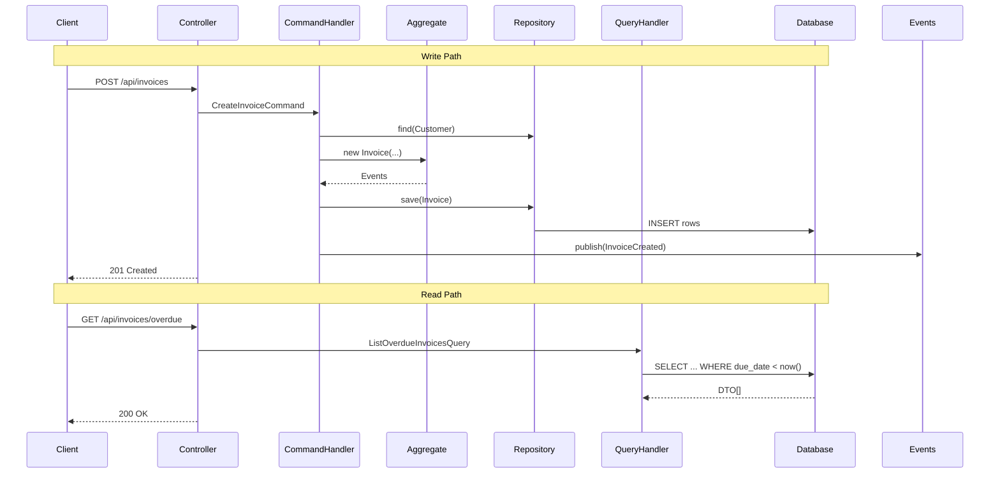
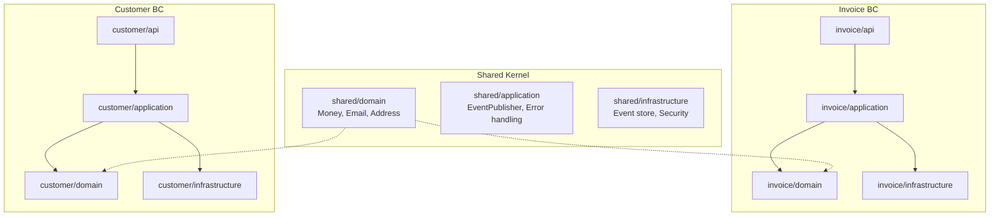
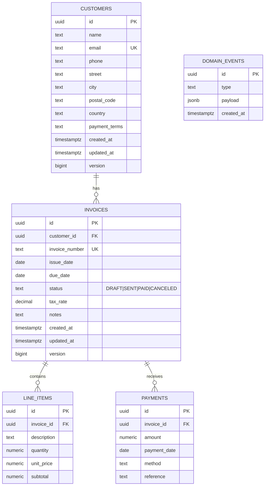

# InvoiceMe Technical Architecture

## Overview

**InvoiceMe** is a modular invoicing ERP backend built on **Domain-Driven Design (DDD)**, **Command-Query Responsibility Segregation (CQRS)**, and **Vertical Slice Architecture (VSA)**.  
It manages the full invoice lifecycle and related customer and payment flows with clear domain boundaries, aggregate-root consistency, and strict separation between reads and writes.

## Architecture Overview

```mermaid
graph TB
    subgraph "Presentation Layer"
        API[REST Controllers<br/>/api/customers<br/>/api/invoices]
    end
    subgraph "Application Layer"
        Cmd[Command Handlers<br/>Create, Update, Send, RecordPayment]
        Qry[Query Handlers<br/>List, GetById, Overdue, Outstanding]
    end
    subgraph "Domain Layer"
        Cust[Customer Aggregate]
        Inv[Invoice Aggregate<br/>LineItems + Payments]
        Ev[Domain Events<br/>InvoiceCreated, PaymentRecorded, ...]
    end
    subgraph "Infrastructure Layer"
        Repo[Repository Adapters<br/>JPA ↔ Domain]
        DB[(PostgreSQL 17<br/>schema.sql init)]
    end
    API --> Cmd
    API --> Qry
    Cmd --> Cust
    Cmd --> Inv
    Inv --> Ev
    Cmd --> Repo
    Qry --> Repo
    Repo --> DB
````

---

## Domain Boundaries

InvoiceMe defines three bounded contexts with explicit aggregate roots.

```mermaid
graph LR
    subgraph "Customer BC"
        C[Customer Aggregate]
        CE[CustomerCreated / Updated / Deleted]
    end
    subgraph "Invoice BC"
        I[Invoice Aggregate]
        L[LineItem VO]
        P[Payment Entity]
        IE[InvoiceCreated / Sent / PaymentRecorded / Paid]
    end
    subgraph "Payment BC"
        PD[Payment Domain Entity<br/>(embedded in Invoice)]
    end
    C -.->|customerId| I
    I --> L
    I --> P
    P -.-> PD
```

### Aggregate Design

**Customer Aggregate (Supporting Domain):**
Root entity with contact and payment-term invariants (non-empty name, valid email). Emits `CustomerCreated|Updated|Deleted`. Referenced by `customerId` in invoices.

**Invoice Aggregate (Core Domain):**
Controls lifecycle `DRAFT → SENT → PAID → CANCELED`.
Contains `LineItem` value objects and `Payment` entities.
Invariants: edits allowed only in `DRAFT`; sum(payments) ≤ total; balance = `total – sum(payments)`.
Emits domain events (`InvoiceCreated`, `InvoiceSent`, `PaymentRecorded`, `InvoicePaid`).

**Payment Entity (Embedded):**
Bound within the invoice transaction. Chosen for MVP simplicity—later separable for cross-invoice settlements or external gateways.

---

## CQRS Implementation



**Command side** updates domain state transactionally through aggregates and persists emitted events.
**Query side** uses lightweight projections and derives computed fields (`balance`, `overdue`) at runtime for perfect consistency.

---

## Vertical Slice Architecture

Each bounded context is self-contained: `api → application → domain → infrastructure`.



**Key principle:** no global `services/` or `repositories/` folders. Each slice owns its layers, promoting isolation, testability, and parallel development.

---

## Design Decisions

### 1. Embedded Payments

Kept inside the Invoice aggregate for transactional atomicity.
*Trade-off:* limits flexibility for future cross-invoice payments.

### 2. In-Memory Event Bus

Domain events published synchronously and stored in `domain_events` (JSONB).
*Rationale:* simpler MVP; auditable.
*Trade-off:* no async cross-service propagation—future Kafka/SNS bridge possible.

### 3. Schema Initialization

`schema.sql` via `spring.sql.init.mode=always` replaces Flyway migrations.
*Rationale:* faster bootstrap; fewer moving parts.
*Trade-off:* versioning to be added once schema evolves.

### 4. Derived State at Query Time

`balance = SUM(line_items) – SUM(payments)` and `overdue` calculated dynamically.
*Rationale:* ensures correctness without denormalized fields.

---

## Database Schema



### Schema Principles

* **Aggregate boundaries = table groups** (`Invoice` owns `LineItems` and `Payments`)
* **Optimistic locking** via `version` column
* **Cascade deletes** from invoices to children
* **Foreign-key integrity** and unique constraints (`email`, `invoice_number`)
* **Event persistence** provides an auditable trail of domain activity

---

## Technology Stack

* **Java 21**, **Spring Boot 3.5**
* **PostgreSQL 17.4**
* **Spring Data JPA (Hibernate)**
* **Schema:** `schema.sql` initialization
* **Testing:** JUnit 5 + Testcontainers
* **Docs:** springdoc-openapi 2.7 / Swagger UI

---

## Summary

InvoiceMe applies DDD to isolate business meaning, CQRS to decouple reads from writes, and VSA to keep each capability autonomous.
The architecture favors **simplicity over ceremony**—in-memory events, schema.sql bootstrapping, and runtime-derived projections—while remaining extensible toward event-driven microservices or richer ERP features.
Bounded contexts cleanly map to the database, ensuring traceable, auditable state transitions from customer creation to invoice payment.
